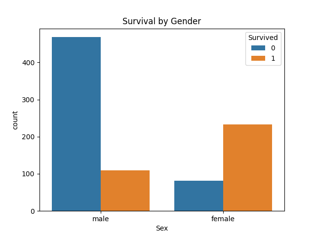
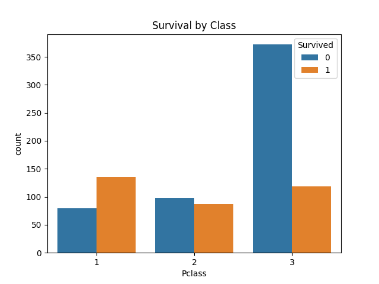
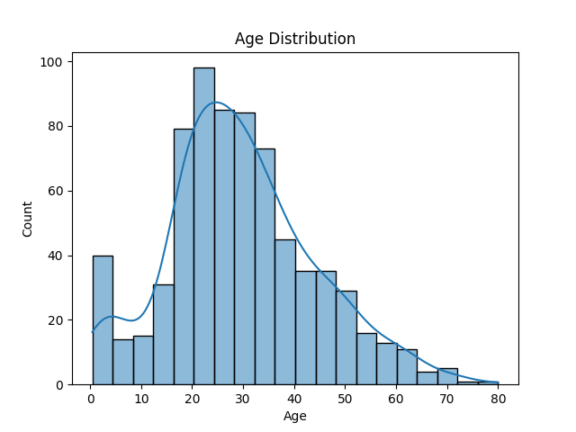
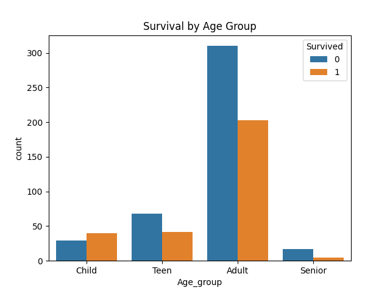
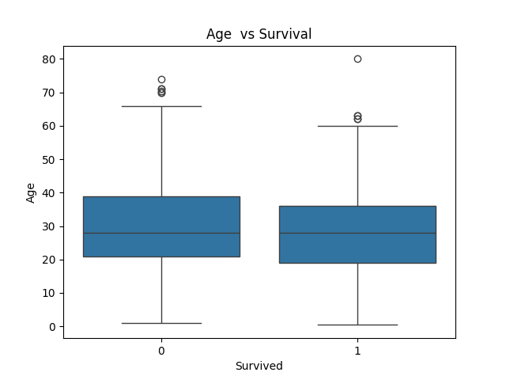

# Titanic Survival Analysis (EDA)

Project Overview
Exploratory Data Analysis on Titanic dataset to understand survival patterns.

 Key Analysis
- Survival rate by Gender
- Survival rate by Passenger Class
- Survival rate by Age Groups
- Age distribution using boxplot & violin plot

 Dataset
- Source: Kaggle Titanic Dataset

 Visualizations
All plots are stored in the `plots/` folder.

 Tools Used
- Python
- Pandas
- Matplotlib
- Seaborn

 Insights
- Females had higher survival rate
- 1st class passengers survived more
- Younger passengers had better chances
# 📊 Visualizations

## Survival by Gender

## Survival by Class

## Age Distribution

## Survival by Age Group

## Boxplot (Age vs Survival)

## Violin Plot

##  Survival Count

